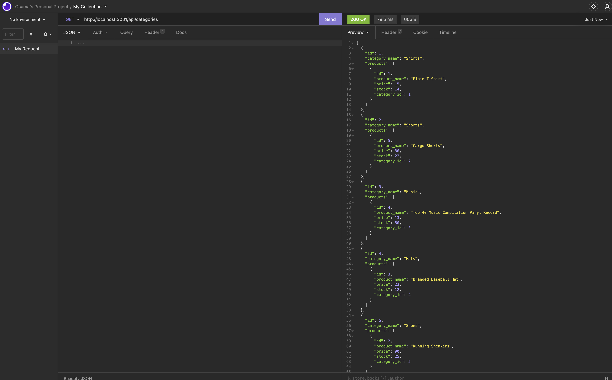

# e-commerce-backend

## Description
* e-commerce-backend consists of a database with retail data that can be created, read, updated, and deleted using express routes. It is an outstanding backend that can be used by a retail company for an e-commerce website.

## Built With
* MySQL
* Sequelize
* Express.js

## Screenshot
* API GET route on insomnia

## Link to Walkthrough Video
* [Walkthrough Part 1](https://watch.screencastify.com/v/CCrlkuUA5Le4LX9w9z7l)
* [Walkthrough Part 2](https://watch.screencastify.com/v/rw75fdleDePHVZ7i7fJJ)

## Contribution
e-commerce-backend ❤️ Made With Love by Osama Dahnoun

